# xv6 的中断和驱动

本文以本仓库 `xv6-labs-2020` 的 **traps 分支**解释中断、陷阱和 alarm。现有工作树处于 net 分支；相对源码链接用于查看共同的设备/I/O 实现，涉及分支差异处明确标为 `traps:路径`。CPU 通过 MMIO 向设备控制器下命令，控制器完成工作后以中断通知 CPU；CPU 经陷阱入口进入内核，内核分派给驱动处理，再恢复原先的执行。定时器走另一条链：每个 hart 的时钟先触发机器模式中断，`timervec` 再置位 S 模式软件中断。下文先解释设备、MMIO 和 I/O，再解释陷阱入口、定时器与外部中断，最后合并这些路径。

文中的 DMA 是 Direct Memory Access（直接内存访问）：VirtIO 磁盘传输使用它，UART 驱动没有使用它。要查看下文使用的准确分支源码，可在 `xv6-labs-2020` 目录执行 `git show traps:kernel/trap.c`；其他文件同样把路径写在 `traps:` 后。

## 1. CPU、驱动与外设是什么关系

CPU 只会执行指令、访问地址和响应陷阱。它不知道“显示字符”或“读取磁盘块”意味着什么。不同控制器又有不同的寄存器、命令格式和完成条件，因此内核需要驱动把统一的 `read/write` 请求翻译成某种控制器听得懂的操作。

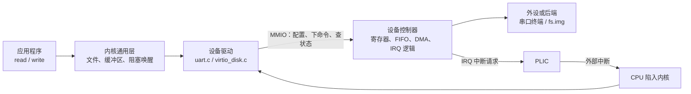

这里要分清软件和硬件：

| 名称 | xv6 中的例子 | 作用 |
|---|---|---|
| 驱动，软件 | `uart.c`、`virtio_disk.c` | 由 CPU 执行，操作控制器并处理完成事件 |
| 设备控制器，硬件 | 16550A UART、VirtIO block | 提供寄存器和 FIFO，执行传输并产生 IRQ；在 QEMU 中由软件模拟硬件行为 |
| 外设/后端 | 串口终端、`fs.img` | 数据最终来自或去往的对象 |
| PLIC，中断控制器 | RISC-V PLIC | 汇聚外部 IRQ，按配置选择一个中断送给某个 hart |

驱动还负责并发和时序：设备忙时让进程睡眠，完成中断到达后再唤醒它；多个进程同时访问时，用锁保护共享状态。

相关源码：[`uart.c`](../xv6-labs-2020/kernel/uart.c)、[`console.c`](../xv6-labs-2020/kernel/console.c)、[`virtio_disk.c`](../xv6-labs-2020/kernel/virtio_disk.c)、[`plic.c`](../xv6-labs-2020/kernel/plic.c)、[`trap.c`](../xv6-labs-2020/kernel/trap.c)。

---

## 2. MMIO：用地址访问控制器寄存器

MMIO 是 Memory-Mapped I/O。处理器执行的仍是普通 load/store 指令，但总线看到地址落在设备区时，会把访问送到设备控制器，而不是 DRAM。

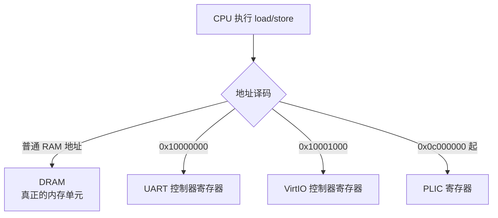

**MMIO 并不是把设备寄存器复制到内存。** 地址空间只是统一编号；访问设备地址会触发控制器的读写动作。例如：

```c
*(volatile unsigned char *)(UART0 + THR) = c;
```

这次 store 会把字符交给 UART 的发送保持寄存器，不会写入某个普通内存字节。`volatile` 告诉编译器每次都要真的发出访问，不能把寄存器读写随意省略。

xv6 为这些物理地址建立同值映射，因此内核开启分页后仍用相同数值访问：

| 控制器 | 物理/内核虚拟地址 | 主要用途 |
|---|---:|---|
| UART0 | `0x10000000` | 收发字符、配置 UART、查询状态 |
| VirtIO0 | `0x10001000` | 协商特性、配置队列、通知设备、确认中断 |
| PLIC | `0x0c000000` 起 | 配置 IRQ 的优先级、使能、阈值、claim/complete |

---

## 3. DMA：为什么磁盘传输需要它

如果只用程序控制 I/O，CPU 要不断读写控制器的数据寄存器，把整块数据一个字节或一个字地搬运。磁盘块很大，这会长期占用 CPU。

DMA 允许设备控制器直接读写 RAM。CPU 只准备“内存地址、长度、方向”等描述信息并启动操作，然后可以运行其他进程或睡眠等待完成。

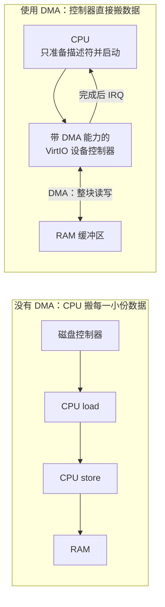

在这个例子里，**DMA 能力位于设备控制器一侧**。它不是 CPU 执行的复制循环，也不是 RAM 中的一片特殊数据。真实硬件可能把 DMA 引擎集成在设备控制器中，也可能使用单独的 DMA 控制器；QEMU 的 VirtIO 设备模拟了控制器直接访问客户机物理内存的效果。

### 3.1 `virtio_disk_rw()` 中的一次 DMA

xv6 在连续的 RAM 页中放置 `desc`、`avail` 和 `used` 队列，并通过 MMIO 的 `QUEUE_PFN` 把队列物理地址告诉控制器。每次读写使用三个描述符：

```text
描述符 0：请求头 {读/写、磁盘扇区}       控制器读取
     │ next
描述符 1：b->data，长度 1024 字节         磁盘读时控制器写 RAM
     │                                    磁盘写时控制器读 RAM
     │ next
描述符 2：1 字节完成状态                  控制器写入
```

完整过程如下：

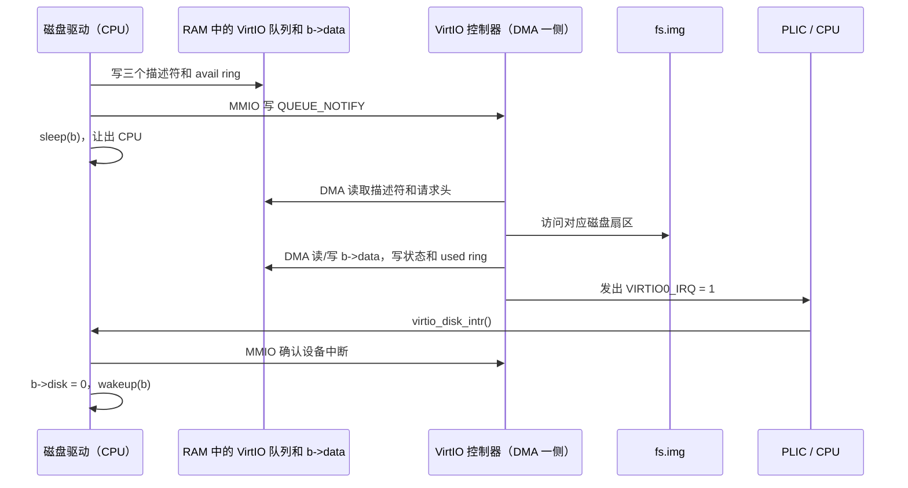

因此 MMIO 和 DMA 分工不同：MMIO 适合少量控制信息；DMA 负责批量数据。中断则通知 CPU “DMA 已完成”。

---

## 4. UART 控制器与串口协议

UART 是 Universal Asynchronous Receiver/Transmitter。它一侧通过 CPU 可见的寄存器和 FIFO 接收字节，另一侧把字节转换成串行比特；接收时做相反转换。

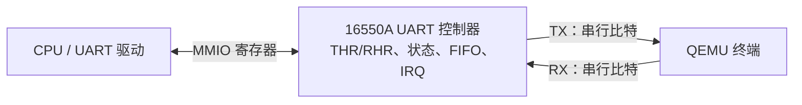

UART 没有共享时钟线，所以收发双方必须预先约定波特率和帧格式。`uartinit()` 配置为 38.4 Kbaud、8 位数据、无校验；停止位配置位保持为 0，对应 1 个停止位，也就是常说的 **38400 8N1**。

一个字符在线路上的概念帧为：

```text
空闲       起始位      8 个数据位（低位先发）            停止位       空闲
  1    │      0     │ d0 d1 d2 d3 d4 d5 d6 d7 │           1      │   1
───────┘            └───────────────────────────┘                  └─────
```

UART 控制器中的关键寄存器：

| 寄存器 | 驱动如何使用 |
|---|---|
| `RHR` | RX FIFO 有字符时，从这里读一个输入字节 |
| `THR` | UART 可以继续发送时，向这里写一个输出字节 |
| `LSR` | `RX_READY` 表示可读，`TX_IDLE` 表示 THR 可接收下一字节 |
| `IER` | 打开接收和发送中断 |
| `FCR` | 启用并清空收发 FIFO |
| `LCR` | 设置波特率锁存模式和 8N1 帧格式 |

QEMU 的 `-nographic` 把模拟 UART 接到当前终端，所以键盘输入看起来直接进入 xv6，UART 输出也直接显示在终端。中间仍然经过模拟的 UART 控制器、IRQ 和驱动流程。

### 4.1 UART 输出

用户态 `write()` 使用一个 32 字节的软件发送环形缓冲区：

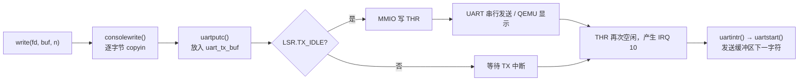

缓冲区满时，写进程睡眠；中断处理中的 `uartstart()` 取走字符后将它唤醒。内核 `printf()` 和输入回显走 `uartputc_sync()`，它轮询 `LSR.TX_IDLE` 后直接写 `THR`，不依赖发送中断。

### 4.2 UART 输入


`consoleread()` 是按行读取的。没有完整输入时进程睡眠，而不是反复轮询 UART；输入中断负责积累字符，并在一行准备好后唤醒读取进程。

---

## 5. 标准输入、标准输出和 `/console`

标准输入输出首先是进程的文件描述符约定，不是三个固定硬件端口：

| fd | 通常名称 | xv6 初始进程中的指向 |
|---:|---|---|
| 0 | stdin，标准输入 | `/console` |
| 1 | stdout，标准输出 | 与 fd 0 相同的 `/console` |
| 2 | stderr，标准错误 | 与 fd 0 相同的 `/console` |

`/init` 通过下面的顺序建立它们：


`/console` 是设备文件：它在文件系统中有名字和 inode，但 inode 中最重要的是 `type=T_DEVICE`、`major=1`、`minor=0`，`/console`并不保存终端字符内容。

初始化时 `consoleinit()` 建立 major number 到驱动函数的映射：

```text
devsw[CONSOLE=1].read  = consoleread
devsw[CONSOLE=1].write = consolewrite
```

因此打开 `/console` 后，`file` 变为 `FD_DEVICE`，以后对它的 `read/write` 会根据 major number 调用 UART console 驱动。

**重定向改变的是进程文件描述符表中的指向。** `0`、`1`、`2` 本身只是整数，通常分别约定为输入、输出和错误输出。这里的用户态 [`printf()`](../xv6-labs-2020/user/printf.c) 实际调用 `vprintf(1, ...)`，[`gets()`](../xv6-labs-2020/user/ulib.c) 实际调用 `read(0, ...)`；原问题中的 fd 方向写反了。shell 的提示符调用 `fprintf(2, "$ ")`，所以即使 fd 1 被重定向，提示符仍可写向 fd 2。系统调用按照传入的 fd 找到当前进程的 `struct file`，并没有给 fd 0/1 绑定固定设备。

例如执行 `echo hello | cat`，shell 调用 `pipe(p)` 得到匿名管道的读端 `p[0]` 和写端 `p[1]`，随后 `fork()` 出左右子进程：

```text
左子进程：close(1) → dup(p[1]) → exec(echo)
          echo 的 write(1, ...) → 管道写端
右子进程：close(0) → dup(p[0]) → exec(cat)
          cat 的 read(0, ...)  ← 管道读端
```

`dup()` 分配最低空闲 fd，因此先关闭 1 或 0 就能让管道端占据相应位置。子进程还会关闭不使用的管道端，父进程关闭自己的两端并等待两个子进程；这样写端全部关闭后，读端才能看到 EOF。`exec()` 更换程序但保留文件描述符表，所以新程序无需知道自己接的是管道。`cmd > out` 和 `cmd < in` 同理：shell 先关闭 fd 1 或 fd 0，再打开文件，让下一次 `open()` 占据这个最低空闲编号。此后程序的输入来源和输出去向随 fd 表而变。实现见 [`sh.c`](../xv6-labs-2020/user/sh.c)。

---

## 6. 中断、异常与陷阱入口

**trap（陷阱、陷入）是进入处理程序的总称；interrupt（中断）是其中一种。** 中断通常由执行流之外的事件异步产生，比如定时器到期、UART 收到字符、VirtIO 磁盘完成传输。异常与执行中的指令同步发生：`ecall` 是主动发起的系统调用异常；非法指令或缺页也是异常。因此“中断”和“陷入”不是两条平行路径，中断会导致一次 trap。

中断使 CPU 能在等待设备时做其他工作，并在完成后及时响应；定时器中断还让内核维护 `ticks`、唤醒计时睡眠的进程，并让运行中的进程 `yield()`，供调度器选择下一个 `RUNNABLE` 进程。定时器间隔可视为粗略的时间片上限，并不保证每次只运行一个进程或每次都切换到不同进程。当前 xv6 常见的中断是 **S 模式软件中断（定时器转发，`scause` 原因码 1）** 和 **S 模式外部中断（PLIC 转发的 UART、VirtIO，原因码 9）**；`ecall`、缺页并不属于中断。

外部设备不会直接调用 C 函数。UART 或 VirtIO 控制器先拉起自己的 IRQ 信号，PLIC 汇聚这些信号；PLIC 选中目标 hart 后，向该 hart 提交 Supervisor external interrupt。CPU 在满足使能条件时，由硬件完成陷阱入口动作。

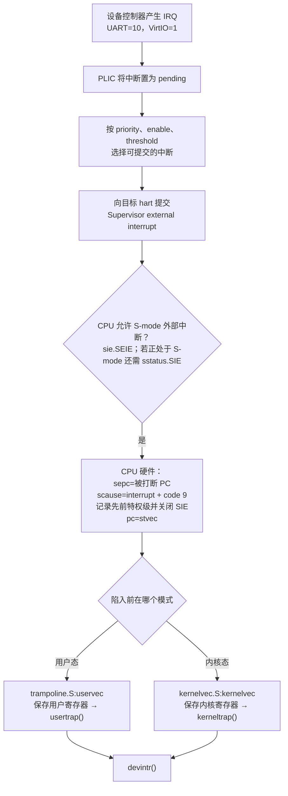

CPU 根据代理配置和中断使能，在可处理时由硬件保存被打断的 PC 到 `sepc`、把原因写入 `scause`、记录旧特权级并清除 `sstatus.SIE`，再将 PC 设为 `stvec`。**`stvec` 指向的是汇编入口，不是 C 函数 `usertrap()` 或 `kerneltrap()`。** 从用户态进入时，`usertrapret()` 事先将它设为 trampoline 中的 `uservec`；`uservec` 保存用户寄存器、切换内核页表和栈后调用 `usertrap()`。从内核态进入时，`stvec` 指向 `kernelvec`，它在内核栈保存寄存器后调用 `kerneltrap()`。硬件陷阱入口可处理中断和异常；traps 分支的 `usertrap()` 处理用户态 `ecall`，`kerneltrap()` 主要分派设备中断，对未识别的内核异常会 panic。返回时由 `userret` 或 `kernelvec` 恢复寄存器并执行 `sret`；普通中断的 `sepc` 不需要前进，而 `ecall` 的 `sepc` 指着该指令，`usertrap()` 要将它加 4 才能继续下一条指令。

`usertrap()` 先用 `scause == 8` 识别用户态 `ecall`，再用 `devintr()` 识别设备/定时器中断；`kerneltrap()` 也用 `devintr()` 分派中断。对 S 模式外部中断，`devintr()` 检查 `scause` 最高位为 1、原因码为 9，随后才向 PLIC 领取 IRQ。对定时器转发的 S 模式软件中断，则检查 `scause == 0x8000000000000001`。traps 分支的准确实现见 `traps:kernel/trampoline.S`、`traps:kernel/kernelvec.S` 和 `traps:kernel/trap.c`。

---

## 7. CLINT 定时器如何转成 S 模式中断

CLINT（Core Local Interruptor）是每个 hart 附近的本地中断/计时硬件接口，与负责外部设备 IRQ 的 PLIC 不同。本项目使用其计数器 `mtime` 和每个 hart 的比较寄存器 `mtimecmp`：当 `mtime` 达到该 hart 的 `mtimecmp` 时，产生**机器模式定时器中断**。在 QEMU 的 `virt` 地址布局中，CLINT 基址为 `0x02000000`；`CLINT_MTIMECMP(id)` 和 `CLINT_MTIME` 在 `traps:kernel/memlayout.h` 中定义。

启动时，`entry.S` 跳到机器模式的 `traps:kernel/start.c` 中的 `start()`，后者调用 `timerinit()`。每个 hart 把 `mtimecmp` 设为“当前 `mtime` + 1,000,000”，约为 QEMU 中的 0.1 秒；为 `timervec` 准备 `mscratch` 指向的临时保存区，设置 `mtvec = timervec` 并使能机器模式定时器中断。**traps 分支正是原笔记的布局**：`mscratch0[NCPU * 32]` 按 hart 分区，每区的 `scratch[4]` 保存 `mtimecmp` 地址，`scratch[5]` 保存间隔；`traps:kernel/kernelvec.S` 用 32/40 字节偏移读取。汇编用 0/8/16 字节保存 `a1`、`a2`、`a3`，并用 `csrrw` 交换 `a0` 与 `mscratch`。

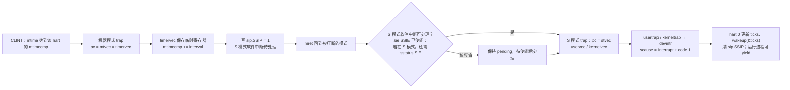

`timervec` 先用 `mscratch` 保存少量寄存器，再将 `mtimecmp` 加一个间隔，预约下次机器模式中断；接着写 `sip` 的 **SSIP 位（值 2）**，产生待处理的 S 模式软件中断，恢复寄存器并 `mret`。这里的“软件中断”是由机器模式程序写入硬件中断待处理位，不是让用户程序调用某个函数；随后硬件按照 `stvec` 和使能条件再次 trap 到 S 模式。`devintr()` 只让 hart 0 的 `clockintr()` 增加全局 `ticks` 并 `wakeup(&ticks)`，每个 hart 仍可根据定时器中断让其运行进程 `yield()`。**清除 `sip.SSIP` 是确认这次软件中断已处理**：若保持 pending，退出处理程序后一旦中断重新使能，CPU 会再次进入同一处理程序。计时中断可能发生在用户态或内核态；后者仅在当前进程存在且状态为 `RUNNING` 时才让出 CPU。

---

## 8. 同步异常与 traps 分支的 alarm

异常不是“外设发 IRQ”。执行指令本身可以使 RISC-V 硬件发现错误并 trap，硬件写入 `scause`、`sepc`，必要时还把出错虚拟地址写入 `stval`。用户态 `ecall` 的 `scause = 8`；**`scause = 13` 是 load page fault，`15` 是 store/AMO page fault，`12` 是 instruction page fault**。它们是缺页异常，不是“缺页中断”。触发它们的也不一定只能是 `ld` 或 `sd` 两条指令；关键是访问类别。RISC-V 整数除零按指令语义产生结果，**不会自动产生除零 trap**，不能把它当成 xv6 的除零异常例子。traps 分支的 `usertrap()` 对未识别的用户异常打印原因并标记进程终止；`kerneltrap()` 对未识别的内核异常直接 panic。

traps 分支实现了 alarm 扩展。`traps:kernel/sysproc.c` 的 `sys_sigalarm()` 接受 `sigalarm(interval, handler)`，设置进程的 `ticks`、`ticks_remain` 和用户处理函数地址。`traps:kernel/trap.c` 的 `usertrap()` 每遇到一次用户态定时器中断，就在 `ticks > 0` 时递减 `ticks_remain`；减到 0 时把完整用户 `trapframe` 复制到 `trapframe_t`，将 **`trapframe->epc`** 改为 `alarm_handler`，然后 `yield()`。下一次返回用户态，`sret` 从 `epc` 指定的处理函数开始执行。处理函数运行期间，计数继续降到负数，不会再次满足“等于 0”的触发条件；`sigreturn()` 会重设间隔。原笔记写成“修改 `trapframe->ra`”是不准确的：`ra` 是函数返回地址寄存器，不决定 trap 返回的 PC。


用户处理函数（如 `traps:user/alarmtest.c` 的 `periodic()`）最后调用 `sigreturn()`。`traps:kernel/sysproc.c` 的 `sys_sigreturn()` 把 `trapframe_t` 复制回当前 `trapframe`、重置 `ticks_remain`，并**返回保存的 `a0`**；`traps:kernel/syscall.c` 会把系统调用返回值写入 `trapframe->a0`，因此这样才能保持中断前的用户 `a0`。原笔记称 `handle_ret`，本分支对应的系统调用名是 `sigreturn`。用户级 alarm 仍由内核先处理硬件中断，再修改返回现场运行用户回调，硬件不会直接跳到用户函数。

---

## 9. PLIC 具体做什么

PLIC（Platform-Level Interrupt Controller）位于设备 IRQ 线和 CPU hart 之间，负责：

1. 记录哪些外部中断源处于 pending；
2. 为每个 IRQ 保存优先级；
3. 为每个 hart/context 保存 IRQ 使能位和优先级阈值；
4. 从合格的 pending IRQ 中选出一个，提交给 hart；
5. 通过 claim 告诉软件 IRQ 编号，通过 complete 接收处理完成通知。

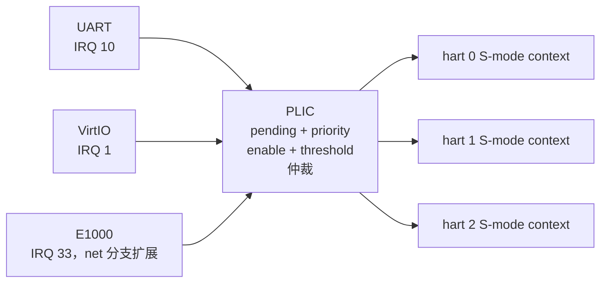

IRQ 编号由 QEMU `virt` 机器的硬件连线决定，不是 `plic.c` 临时发明的。xv6 用相同常量配置并识别这些信号：

| 中断源 | IRQ ID | 驱动处理函数 |
|---|---:|---|
| VirtIO block | 1 | `virtio_disk_intr()` |
| UART0 | 10 | `uartintr()` |
| E1000，net 分支扩展；traps 分支未启用 | 33 | `e1000_intr()` |

以 UART 和 VirtIO 为例，启动配置为：

```text
plicinit():
  priority[10] = 1
  priority[1]  = 1

plicinithart():                  每个 hart 各做一次
  enable = bit(10) | bit(1)
  threshold = 0                  priority 1 > threshold 0，可以提交

start():
  sie.SEIE = 1                   CPU 接受 S-mode external interrupt
```

一次处理中最重要的是 claim/complete 配对：

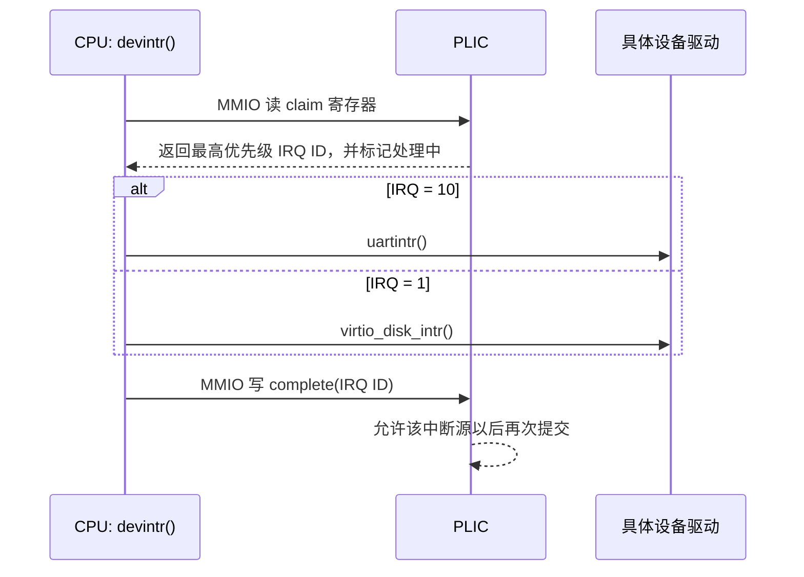

PLIC 只负责路由和仲裁，不会读取 UART 字符，也不会完成磁盘请求；这些设备特有工作仍由相应驱动完成。

---

## 10. 为什么、何时关闭中断

关闭中断的主要理由是避免**同一 hart 的中断处理程序在关键操作中重入**。例如普通内核代码持有一个中断处理程序也要获取的自旋锁时，如果本 hart 的中断此刻到来，中断处理程序会等待这把锁；但持锁代码已经被打断，无法释放锁，于是死锁。跨 hart 的并发仍要靠锁，单独关本 hart 的中断不能代替互斥。

xv6 的 `acquire()` 先调用 `push_off()`，关本 hart 的 S 模式中断，再获取自旋锁；`release()` 释放锁后 `pop_off()`。嵌套的 `push_off/pop_off` 记录原先是否使能，最后一层退出时才恢复，避免内层过早开中断。见 `traps:kernel/spinlock.c`。

另一处是 `usertrapret()`：内核将 `stvec` 从 `kernelvec` 改成 `uservec`，又要设置用户 trapframe、页表和返回状态。切换期间若在 S 模式再次中断，入口会与当前执行状态不匹配，所以它先 `intr_off()`，直到 `sret` 回到用户态。陷入 S 模式时硬件也会先清 `sstatus.SIE`，让入口保存现场期间不会被同级中断打断；系统调用保存好 `sepc` 等状态后，`usertrap()` 才主动 `intr_on()`。`intr_off()` 清的是本 hart 的 S 模式全局使能位；设备 IRQ 或定时器 pending 位可以保留，待条件允许后再处理，它不是关闭设备或停止时钟。

---

## 11. 普通文件、管道和设备文件如何读写

三类对象共用文件描述符和系统调用入口，到 `fileread/filewrite` 才根据 `struct file.type` 分流。

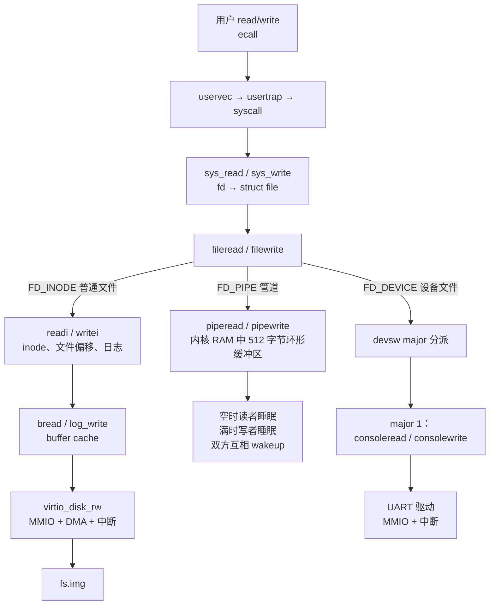

三条路径的本质区别：

| 类型 | 数据放在哪里 | 是否经过磁盘 | 阻塞/完成方式 |
|---|---|---|---|
| 普通文件 `FD_INODE` | `fs.img` 的 inode 和数据块，常用块缓存在 RAM | 是 | 缓存未命中或落盘时等待 VirtIO DMA 完成中断 |
| 管道 `FD_PIPE` | 内核 `struct pipe.data[512]` | 否 | 空时读者睡眠，满时写者睡眠，另一端操作后唤醒 |
| 设备文件 `FD_DEVICE` | 文件 inode 只保存 major/minor；真实数据由设备产生或消费 | 只需从文件系统找到设备 inode，字符 I/O 不走文件数据块 | 由 `devsw[major]` 进入具体驱动；console 输入和缓冲输出依赖 UART 中断 |

设备文件提供的是“文件名 → major/minor → 驱动函数”的桥梁。它让应用仍可使用 `open/read/write`，而不需要知道 UART 的寄存器地址或中断号。

---

## 12. 总结：两条中断链与三类 I/O

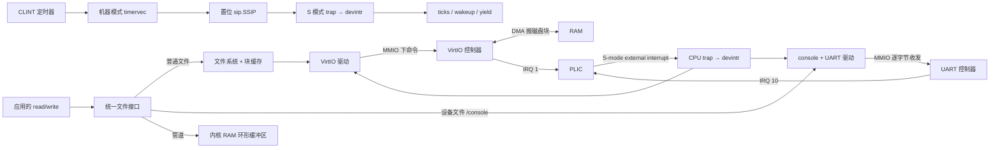

这两条链合起来就能解释 xv6 的“中断和驱动”：**定时器**由 CLINT 触发机器模式 trap，`timervec` 置位 `sip.SSIP`，S 模式的 `devintr()` 更新时钟、唤醒进程并推动调度；**外设**由驱动用 MMIO 配置和通知控制器，VirtIO 可用 DMA 搬数据，设备 IRQ 经 PLIC 进入 S 模式的 `devintr()`，相应驱动处理完成事件并唤醒等待进程。两者都由硬件进入汇编陷阱入口，再由 C 代码分派，最后恢复被打断的执行。普通文件、管道、设备文件共享 fd 接口，但数据位置和阻塞唤醒方式各不相同。

参考阅读：MIT [`xv6` RISC-V 手册第 4～6 章](https://pdos.csail.mit.edu/6.1810/2024/xv6/book-riscv-rev4.pdf)、[traps 实验说明](https://pdos.csail.mit.edu/6.1810/2025/labs/traps.html)、[RISC-V Supervisor-Level ISA](https://docs.riscv.org/reference/isa/v20240411/priv/supervisor.html) 与 [整数除零的指令语义](https://docs.riscv.org/reference/isa/v20240411/unpriv/m-st-ext.html)。具体寄存器偏移与 alarm 调用流程以本仓库 traps 分支的源码为准。

