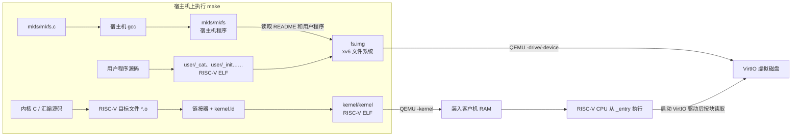
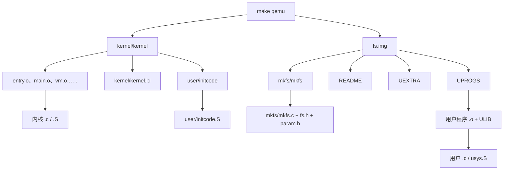
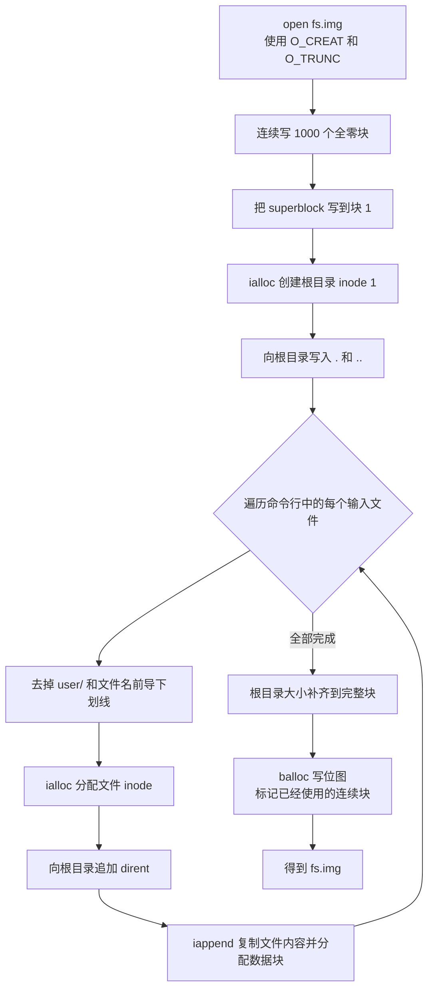
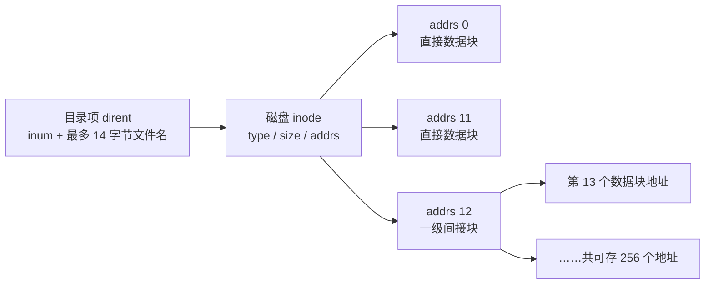
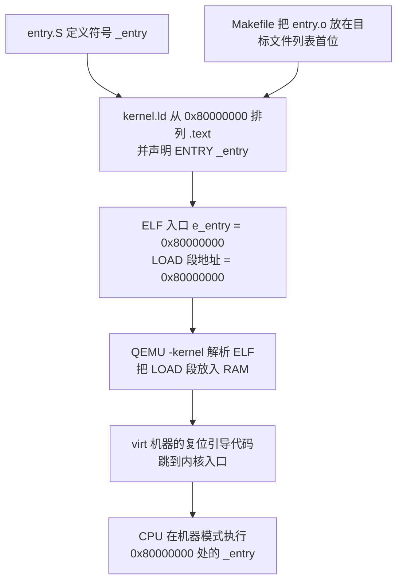
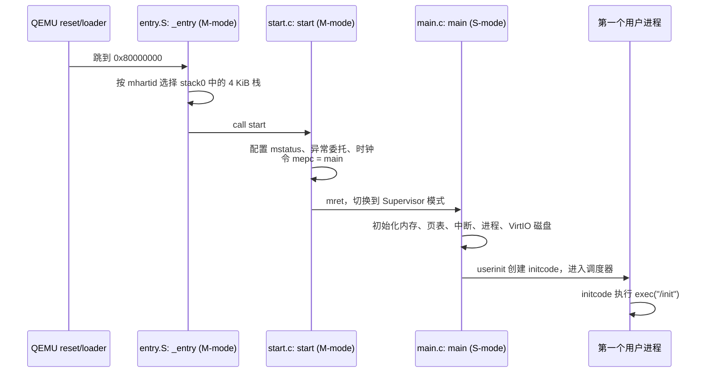
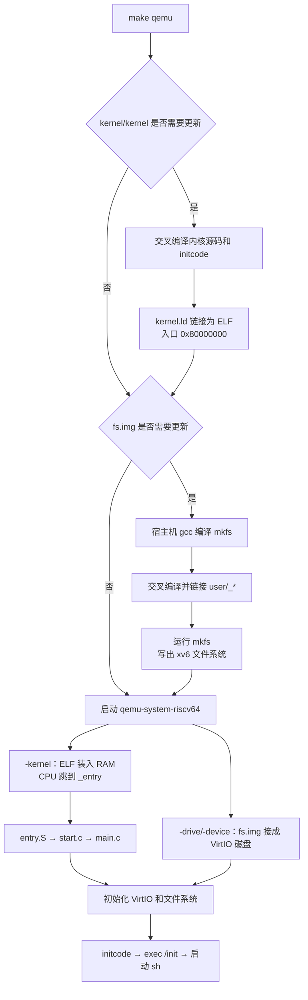

# xv6 的镜像制作和加载

> 本文对应 `xv6-labs-2020` 这份 RISC-V 源码。这里容易混淆的名字有两个：
>
> - `kernel/kernel` 是带 ELF 头的 **RISC-V 内核可执行文件**；
> - `fs.img` 是 1000 个文件系统块组成的 **原始磁盘镜像**。
>
> 它们不是一个文件，也不是由一个文件包住另一个文件。QEMU 分别处理它们。

## 1. 先看全貌



一句话概括：`make` 在宿主机上准备好“内核”和“磁盘”两件东西；QEMU 把内核放入内存，把 `fs.img` 接成一块硬盘。

相关源码：[`Makefile`](../xv6-labs-2020/Makefile)、[`mkfs/mkfs.c`](../xv6-labs-2020/mkfs/mkfs.c)、[`kernel/kernel.ld`](../xv6-labs-2020/kernel/kernel.ld)、[`kernel/entry.S`](../xv6-labs-2020/kernel/entry.S)。

---

## 2. `make qemu` 如何组建两个产物

`qemu` 目标写成：

```make
qemu: $K/kernel fs.img
	$(QEMU) $(QEMUOPTS)
```

所以运行 `make qemu` 时，Make 会先递归检查下面两棵依赖树；缺少产物或依赖比产物新时，才执行相应命令。



两条编译链使用的编译器不同：

| 产物 | 在哪里运行 | 编译/链接工具 |
|---|---|---|
| `mkfs/mkfs` | 当前 Linux 宿主机 | 普通 `gcc` |
| `kernel/kernel`、`user/_*` | QEMU 模拟的 RISC-V 机器 | `riscv64-...-gcc/ld` |

`mkfs` 必须在制作镜像时立刻运行，所以它是宿主机程序；被放进 `fs.img` 的 `_cat`、`_sh` 等程序将来要在 xv6 中运行，所以它们是 RISC-V 程序。

### 2.1 用户程序怎样进入 `fs.img`

当前 `conf/lab.mk` 是 `LAB=net`。因此 `UPROGS` 是基础用户程序再加 `_nettests`，`UEXTRA` 为空。Make 最终执行的命令可理解为：

```text
mkfs/mkfs fs.img README \
  user/_cat user/_echo user/_forktest user/_grep user/_init \
  user/_kill user/_ln user/_ls user/_mkdir user/_rm user/_sh \
  user/_stressfs user/_usertests user/_grind user/_wc user/_zombie \
  user/_nettests
```

这里不是把文件简单拼接到镜像尾部。`mkfs` 会把每个输入文件变成 xv6 文件系统中的一个 inode、一个根目录项和若干数据块。

`user/_cat` 进入镜像后叫 `cat`：下划线只是宿主机侧的保护性前缀，避免和 Linux 的 `cat`、`rm` 等命令重名；`mkfs` 写目录项时会去掉它。`user/` 前缀也会去掉。

---

## 3. `mkfs` 制作 `fs.img` 的流程

### 3.1 先计算布局

这份源码中的固定参数为：

```text
BSIZE   = 1024 字节/块
FSSIZE  = 1000 块
NINODES = 200
LOGSIZE = 30 块
```

由 `mkfs` 计算得到：

```text
nbitmap      = FSSIZE / (BSIZE × 8) + 1 = 1 块
IPB          = BSIZE / sizeof(dinode)   = 1024 / 64 = 16 inode/块
ninodeblocks = NINODES / IPB + 1       = 13 块
nmeta        = 2 + 30 + 13 + 1         = 46 块
nblocks      = FSSIZE - nmeta           = 954 个数据区块
镜像大小      = 1000 × 1024             = 1,024,000 字节
```

### 3.2 再写入镜像



其中三个函数各管一层：

| 函数 | 工作 |
|---|---|
| `wsect(blockno, buf)` | 用 `blockno × BSIZE` 定位，整块写入镜像 |
| `ialloc(type)` | 分配 inode 编号，初始化 `type/nlink/size` 后写入 inode 区 |
| `iappend(inum, data, n)` | 为文件分配数据块，复制内容，更新 inode 的 `size` 和 `addrs[]` |

`mkfs` 的块分配器很简单：`freeblock` 从 46 开始，只向后递增。因此新镜像中已用块从 0 开始连续排列，最后由 `balloc(freeblock)` 一次写好位图。

---

## 4. `fs.img` 里面具体有什么

### 4.1 整张磁盘的块布局

```text
低块号                                                                 高块号

  0       1          2 ........ 31      32 ...... 44      45       46 ........ 999
┌───────┬──────────┬──────────────────┬─────────────────┬────────┬──────────────────┐
│ boot  │  super   │       log        │     inodes      │ bitmap │   data blocks    │
│ 1 块  │   1 块   │      30 块       │      13 块      │  1 块  │      954 块      │
└───────┴──────────┴──────────────────┴─────────────────┴────────┴──────────────────┘
  全零     描述布局      文件系统事务日志       磁盘 inode 表       空闲位图    目录和文件内容
```

块 0 虽然叫 boot block，但本项目不会从它启动。RISC-V 内核由 QEMU 的 `-kernel kernel/kernel` 单独加载，所以 `mkfs` 将块 0 保持为零。

块 1 中的 superblock 实际字段为：

| 字段 | 值 | 含义 |
|---|---:|---|
| `magic` | `0x10203040` | xv6 文件系统标识 |
| `size` | 1000 | 镜像总块数 |
| `nblocks` | 954 | 数据区块数 |
| `ninodes` | 200 | inode 数量 |
| `nlog` | 30 | 日志块数 |
| `logstart` | 2 | 日志从块 2 开始 |
| `inodestart` | 32 | inode 区从块 32 开始 |
| `bmapstart` | 45 | 位图在块 45 |

### 4.2 一个文件怎样落到磁盘块中

每个磁盘 inode 是 64 字节，保存文件类型、大小和 13 个块地址。前 12 个地址直接指向数据块，最后 1 个地址指向“一级间接块”。



因此目录项只负责“名字 → inode 编号”；inode 再负责“文件属性 → 内容所在的块”。一个文件最多使用 `12 + 256 = 268` 个数据块。

### 4.3 根目录中的初始内容

一次全新构建时，根目录 inode 为 1，根目录数据从块 46 开始。当前 `LAB=net` 会让 `mkfs` 创建：

```text
/
├── README
├── cat       ├── echo      ├── forktest  ├── grep
├── init      ├── kill      ├── ln        ├── ls
├── mkdir     ├── rm        ├── sh        ├── stressfs
├── usertests ├── grind     ├── wc        ├── zombie
└── nettests
```

目录中还存在两个特殊项：`.` 和 `..`，二者都指向根目录 inode 1。

当前工作区里的 `fs.img` 还可以看到 `console` 设备文件。这不是 `mkfs` 的输入；第一次启动后，用户程序 `/init` 会执行 `mknod("console", ...)`，修改这块可写磁盘。也就是说，QEMU 中的写操作会保留在宿主机的 `fs.img` 中。


若要恢复完全由 `mkfs` 生成的初始状态，可运行 `make clean` 后重新构建。Makefile 中的 `.PRECIOUS: %.o` 只保护中间目标；平时如果依赖没有更新，`make qemu` 也不会主动重建已经存在的 `fs.img`。

---

## 5. 内核 `kernel/kernel` 如何布局

### 5.1 链接命令

Makefile 把内核目标文件交给链接器，并用 `kernel.ld` 控制布局：

```text
riscv64-...-ld -z max-page-size=4096 \
  -T kernel/kernel.ld \
  -o kernel/kernel \
  kernel/entry.o kernel/kalloc.o ... kernel/start.o ...
```

链接器的输入不是源码，而是编译器和汇编器生成的 `.o`。这些 `.o` 本身通常也是 ELF，只不过类型是可重定位文件 `ET_REL`：机器指令已经生成，但外部符号的地址还没有确定，函数调用和全局变量访问中仍保留着等待处理的重定位项。

这里常说的“编译内核”，实际上包含两个阶段：

```text
kernel/*.c、kernel/*.S
          │ 编译 / 汇编
          ▼
kernel/*.o（ELF ET_REL，可重定位）
          │ ld 链接
          ▼
kernel/kernel（ELF ET_EXEC，可执行）
```

`ld` 不会简单拼接 `.o`，而会：

1. 合并各输入文件中同类的 section，例如把多个 `.text` 合成输出 `.text`；
2. 汇总符号表，找到跨文件引用的函数和全局变量定义；
3. 根据最终地址修正调用指令和数据引用，也就是完成重定位；
4. 按链接脚本安排输出 section 的地址；
5. 生成 ELF Header、Program Header Table 和输出 section。

用户程序也经过同样的过程。例如构建 `user/_cat` 时，规则可展开为：

```text
riscv64-...-ld -z max-page-size=4096 -N -e main -Ttext 0 \
  -o user/_cat \
  user/cat.o user/ulib.o user/usys.o user/printf.o user/umalloc.o
```

| 参数 | 作用 |
|---|---|
| `-N` | 生成 OMAGIC 风格布局，将文本段和数据段设为可读写，并取消常规的数据段页对齐 |
| `-e main` | 把用户 ELF 的入口 `e_entry` 设置为 `main` |
| `-Ttext 0` | 把 `.text` 的运行时虚拟地址设为 `0`；这不是说指令位于 ELF 文件偏移 `0` |
| `-o $@` | `$@` 是当前 Make 目标，例如 `user/_cat` |
| `$^` | 当前目标的全部依赖，例如 `cat.o` 和用户库目标文件 |

因此 `kernel/kernel`、`user/_cat`、`user/_sh` 和 `user/_init` 虽然没有 `.elf` 扩展名，内容仍然是 RISC-V ELF 可执行文件。文件格式由内部魔数和头部决定，与文件名后缀无关。`user/initcode` 是例外：Make 先得到 ELF 格式的 `initcode.out`，再用 `objcopy -O binary` 提取成直接嵌入内核的原始机器码。

### 5.2 ELF 的 Section 与 Segment

ELF 全称是 **Executable and Linkable Format**。它既要服务构建阶段，也要服务运行阶段，所以提供两种不同视图：

| 概念 | 面向的阶段 | 描述内容 | 主要使用者 |
|---|---|---|---|
| section（节） | 编译、链接和调试 | 一类逻辑内容，例如 `.text`、`.data`、`.bss`、`.symtab` | 编译器、链接器、GDB、`objdump` |
| Section Header（节头） | 编译、链接和调试 | 某个 section 的类型、文件偏移、大小、地址和对齐方式 | 链接器与分析工具 |
| segment（段） | 装载和运行 | 需要作为一个整体映射到内存的区域 | 加载器 |
| Program Header（程序头） | 装载和运行 | 某个 segment 的文件位置、目标地址、大小和权限 | QEMU 或操作系统的 `exec()` |

一个 ELF 文件的简化结构如下：

```text
文件偏移 0
┌──────────────────────────────┐
│ ELF Header                   │
│ magic / machine / entry      │
│ phoff / phnum / shoff / shnum│
├──────────────────────────────┤
│ Program Header Table         │  描述运行时 segment
├──────────────────────────────┤
│ 代码、只读数据、数据等内容   │
├──────────────────────────────┤
│ Section Header Table         │  描述链接时 section
└──────────────────────────────┘
```

ELF Header 位于文件开头，其中 `magic` 必须是 `0x7fELF`；`e_entry` 给出入口地址；`e_phoff/e_phnum` 给出 Program Header Table 的位置和表项数；`e_shoff/e_shnum` 则描述 Section Header Table。xv6 在 [`kernel/elf.h`](../xv6-labs-2020/kernel/elf.h) 中使用去掉 `e_`、`p_` 前缀的简化字段名。

section 是链接器眼中的逻辑分类。例如一个 `.o` 可能包含：

```text
.text       函数指令
.rodata     字符串和只读常量
.data       已初始化全局变量
.bss        未初始化全局变量
.symtab     符号表
.rela.text  等待链接器处理的重定位项
.debug_*    调试信息
```

链接器先把输入 `.o` 的 section 合并为输出 section，再把运行时需要的输出 section 组织成 segment。一般可形成如下关系：

```text
输入 section                  输出 section             运行时 segment
各 .o 的 .text    ────────>   .text    ──┐
各 .o 的 .rodata  ────────>   .rodata  ──┴──> LOAD（通常 R-X）
各 .o 的 .data    ────────>   .data    ──┐
各 .o 的 .bss     ────────>   .bss     ──┴──> LOAD（通常 RW-）

.symtab / .debug_* ───────> 仍可留在文件中，但不属于必须装入内存的 LOAD 段
```

因此 section 和 segment 不是一一对应：一个 segment 可以覆盖多个 section，不参与运行的 section 也可以不属于任何 `LOAD` segment。`.o` 主要依赖 Section Header，通常还没有可供运行时使用的 Program Header；最终可执行 ELF 才包含加载器需要的 Program Header。

Program Header 中最关键的字段是 `p_offset`、`p_vaddr`、`p_filesz`、`p_memsz` 和 `p_flags`：它们分别表示从文件哪里读取、映射到哪个虚拟地址、复制多少文件字节、分配多少内存，以及设置何种权限。`.bss` 不需要在文件中保存一长串零，因此它会使 `p_memsz` 大于 `p_filesz`；加载器分配多出的内存并将其保持为零。

Section Header 和符号表即使被 `strip` 删除，程序仍可能正常运行；只要 ELF Header 与 Program Header 完整，加载器就知道该怎样创建内存映像。这也说明运行时真正关键的是 segment，而不是 section 名称。

### 5.3 `kernel.ld` 的关键安排

链接脚本决定的不只是各 section 的排列顺序，还会创建供 C、汇编代码引用的边界符号。`trampoline`、`etext` 和 `end` 正好展示了这两个作用。

#### 5.3.1 从 `_entry` 开始安排内核

```ld
ENTRY(_entry)           /* 把 ELF 入口符号设为 _entry */
. = 0x80000000;         /* 后续 section 从这个地址布局 */

.text : {
  *(.text .text.*)
  . = ALIGN(0x1000);
  _trampoline = .;
  *(trampsec)
  . = ALIGN(0x1000);
  PROVIDE(etext = .);
}
.rodata : { ... }
.data   : { ... }
.bss    : { ... }
PROVIDE(end = .);
```

链接脚本中的 `.` 是位置计数器。`. = 0x80000000` 让后续输出 section 从 `KERNBASE` 开始取得链接地址；这份脚本也没有用 `AT(...)` 另设加载地址，因此生成的内核 `LOAD` segment 同样要被装入这段物理内存。

入口由两个条件共同确定：

1. `OBJS` 中 `kernel/entry.o` 排在最前面，所以它的 `.text` 最先被放进输出 `.text`，`_entry` 正好位于 `0x80000000`；
2. `ENTRY(_entry)` 又把 ELF 头中的入口地址指定为 `_entry`。

汇编器在生成 `entry.o` 时只需记录 `_entry` 位于该目标文件 `.text` 的什么位置；链接器合并输入 section 后，才把它解析为最终地址 `0x80000000`。QEMU 随后根据 Program Header 把内核装入 RAM，并根据 ELF 入口跳到这里。第 6 节会继续展开这段装载过程。

#### 5.3.2 `trampoline` 的地址如何确定

[`kernel/trampoline.S`](../xv6-labs-2020/kernel/trampoline.S) 先定义输入 section 和全局标签：

```asm
.section trampsec
.globl trampoline
trampoline:
```

此时汇编器只知道 `trampoline` 位于 `trampsec` 中，并不知道它在完整内核里的绝对地址。链接器处理下面这段脚本时，才确定最终地址：

```ld
.text : {
  *(.text .text.*)       /* 先放普通内核代码 */

  . = ALIGN(0x1000);     /* 向上对齐到页边界 */
  _trampoline = .;
  *(trampsec)            /* 再放 trampoline.S 的代码 */

  . = ALIGN(0x1000);     /* 补齐 trampoline 所在页 */
  ASSERT(. - _trampoline == 0x1000,
         "error: trampoline larger than one page");
  PROVIDE(etext = .);
}
```

布局过程可以概括为：

```text
0x80000000
    │
    ├── 各输入文件的 .text / .text.*
    │
    ├── ALIGN(0x1000)：对齐到 4 KiB 页边界
    │   _trampoline = trampoline = 这一页的起点
    │
    ├── trampsec：trampoline.S 的代码
    │
    └── ALIGN(0x1000)：补齐到这一页的末尾
        etext = 下一页的起点
```

这里有两个名字相近但来源不同的符号：

- `_trampoline` 由链接脚本在当前位置创建，用来记录页起点并检查大小；
- `trampoline` 由汇编标签定义，是 C 和汇编代码实际引用的入口符号。

因为 `trampsec` 紧接在 `_trampoline` 后放置，而 `trampoline` 又位于该 section 的开头，所以当前布局下两者数值相等。`ASSERT` 则保证从 `_trampoline` 到下一页边界恰好只有一页；如果 trampoline 代码膨胀到无法放入一页，链接会直接失败。

这个地址并没有被写死。前面普通内核代码的大小改变时，对齐后的 `trampoline` 地址也可能随之改变；不变的是它始终页对齐并独占一页。

#### 5.3.3 `etext` 与 `end` 是链接边界，不是 C 对象

`etext` 没有对应的 C 变量或汇编标签，而是链接脚本直接创建的符号：

```ld
PROVIDE(etext = .);
```

执行到这里时，位置计数器已经越过并补齐了 trampoline 页。因此 `etext` 表示整个输出 `.text` 的结束地址，同时也是后续 `.rodata` 的起始边界。

[`kernel/vm.c`](../xv6-labs-2020/kernel/vm.c) 中的声明：

```c
extern char etext[];
```

不会分配一个字符数组；它只是告诉编译器，链接时会有名为 `etext` 的外部符号。表达式 `(uint64)etext` 取得的是链接器赋给该符号的地址。`end` 的原理相同，只是它在 `.bss` 之后定义：

```ld
PROVIDE(end = .);
```

两者分别回答不同的问题：

| 符号 | 所在边界 | 内核中的用途 |
|---|---|---|
| `etext` | `.text` 之后、`.rodata` 之前 | 划分内核代码映射和后续内存映射的权限 |
| `end` | `.bss` 之后 | 标记内核静态映像末尾，后面的完整物理页才能交给页分配器 |

#### 5.3.4 为什么链接地址还能作为物理地址使用

这些符号首先都是链接地址。它们之所以也能直接作为物理地址传给页表代码，不是 C 自动完成了地址转换，而是 xv6 特意让三套地址约定保持一致：

```text
kernel.ld 的链接地址：从 0x80000000 开始
QEMU 的加载物理地址：从 0x80000000 开始
内核主体的页表映射： VA 与 PA 数值相同
```

[`kvmmake()`](../xv6-labs-2020/kernel/vm.c) 对内核主体建立恒等映射：

```c
// 内核代码：可读、可执行
kvmmap(kpgtbl,
       KERNBASE,
       KERNBASE,
       (uint64)etext - KERNBASE,
       PTE_R | PTE_X);

// etext 之后的数据以及可用物理内存：可读、可写
kvmmap(kpgtbl,
       (uint64)etext,
       (uint64)etext,
       PHYSTOP - (uint64)etext,
       PTE_R | PTE_W);
```

`kvmmap()` 的前两个地址参数依次是虚拟地址和物理地址。这里两者相等，所以诸如 `(uint64)etext`、`(uint64)trampoline` 这样的链接符号值，也正好等于其内容所在的物理地址数值。

但小写链接符号 `trampoline` 和大写宏 `TRAMPOLINE` 不是同一个地址：

```c
extern char trampoline[];          // trampoline.S 的链接符号
#define TRAMPOLINE (MAXVA-PGSIZE)  // 人为选定的高位虚拟地址
```

内核还会建立一条额外映射：

```c
kvmmap(kpgtbl,
       TRAMPOLINE,           // 高位虚拟地址
       (uint64)trampoline,   // trampoline 代码所在物理页
       PGSIZE,
       PTE_R | PTE_X);
```

同一物理页因此拥有两个虚拟地址别名：

```text
低位直接映射：VA trampoline ──→ PA trampoline
高位特殊映射：VA TRAMPOLINE ──→ PA trampoline
```

每个用户页表也会把 `TRAMPOLINE` 映射到同一物理页。于是 trampoline 代码切换用户页表与内核页表时，当前高位虚拟地址在切换前后都有效，CPU 可以继续执行下一条指令。

#### 5.3.5 一次实际构建中的布局

下面是本文记录的一次 `kernel/kernel` 构建结果。除固定的起始地址外，其他具体数值会随编译选项和代码大小变化；理解边界之间的关系比记忆这些数值更重要。

```text
低地址                                                                     高地址

0x80000000  _entry
     │
     │ .text：内核指令
     │
0x80008000  trampoline / _trampoline
     │      恰好保留 1 页（4 KiB）
0x80009000  etext，同时也是 .rodata 起点
     │ .rodata：只读常量
0x80009868  .data：已初始化全局变量
0x8000a000  .bss：零初始化全局变量
     │
0x8001f380  stack0：8 个 CPU × 4 KiB 的启动栈
     │
0x80027480  end：内核静态映像结束
     │
     │ 页分配器可管理的物理内存
     ▼
0x88000000  PHYSTOP（0x80000000 + 128 MiB）
```

可以用符号表和 ELF 工具核对自己构建出的实际地址与 section 范围：

```sh
grep -E ' (trampoline|_trampoline|etext|end)$' kernel/kernel.sym

riscv64-linux-gnu-nm kernel/kernel \
  | grep -E ' (trampoline|_trampoline|etext|end)$'

riscv64-linux-gnu-readelf -S kernel/kernel
```

---

## 6. QEMU 怎样找到 `entry.S`

Makefile 给 QEMU 的核心参数为：

```text
-machine virt
-bios none
-kernel kernel/kernel
-m 128M
-smp 3
-nographic
```

`-bios none` 表示不用 OpenSBI 等外部固件；`-kernel` 让 QEMU 的加载器读取内核 ELF。这里形成了一个完整的地址约定：



所以 QEMU 并不认识 `entry.S` 这个源码文件名。它只认识 ELF 中的加载地址和入口地址；`entry.S → entry.o → _entry → ELF entry` 这条链由汇编器和链接器建立。

当前内核的 ELF 入口经核对就是：

```text
e_entry = 0x80000000 = _entry
```

### 6.1 加载器怎样把 ELF 变成内存映像

链接器在构建阶段把多个 `.o` 变成一个带装载说明的 ELF；加载器则在运行阶段读取这份说明，把 ELF 变成 CPU 可以执行的内存映像。两者不要混淆：

| 对象 | 构建它的链接器 | 运行时加载器 | 加载结果 | 入口 |
|---|---|---|---|---|
| `kernel/kernel` | RISC-V `ld` | QEMU 的 `-kernel` 加载逻辑 | 客户机 RAM 中的内核映像 | `_entry` |
| `user/_cat` 等用户 ELF | RISC-V `ld` | xv6 的 [`exec()`](../xv6-labs-2020/kernel/exec.c) | 当前进程的新用户页表、代码、数据和栈 | `main` |

`mkfs` 不是加载器：它只是把已经链接好的用户 ELF 当作普通文件写入 `fs.img`。等 xv6 运行后，`exec()` 才通过文件系统读取并解释这些 ELF。

以用户程序为例，`exec()` 的核心步骤是：

```text
1. namei(path) 找到 ELF 文件的 inode
2. 从文件偏移 0 读取 ELF Header，并检查 0x7fELF 魔数
3. 创建一张新的用户页表
4. 从 elf.phoff 开始遍历 elf.phnum 个 Program Header
5. 对每个 PT_LOAD segment：
   - 按 p_vaddr + p_memsz 分配并映射物理页
   - 从文件 p_offset 处复制 p_filesz 字节
   - 让 p_memsz - p_filesz 的区域保持为零
6. 在程序末尾创建保护页和用户栈，复制 argc、argv
7. 设置 epc = elf.entry、sp = 新栈顶
8. 成功后才替换旧页表并释放旧程序映像
```

这三个地址容易混淆：

```text
p_offset：内容在 ELF 文件中的偏移
p_vaddr ：内容在进程中的目标虚拟地址
物理地址：由 uvmalloc 分配，再通过页表与 p_vaddr 建立映射
```

[`loadseg()`](../xv6-labs-2020/kernel/exec.c) 会用 `walkaddr()` 将 `p_vaddr` 对应的用户虚拟页翻译成物理页，再由 `readi()` 从 inode 的 `p_offset` 位置把数据复制进去。它只复制 `p_filesz` 字节；[`uvmalloc()`](../xv6-labs-2020/kernel/vm.c) 分配页面时已经清零，所以 `.bss` 对应的剩余区域自然为零。

这份 2020 版 xv6 为用户程序分配页面时统一设置 `PTE_R | PTE_W | PTE_X | PTE_U`，没有依据 Program Header 的 `p_flags` 分别保护代码和数据；这是教学实现的简化。无论如何，`exec()` 都不需要 `.text`、`.data` 等 section 名称，也不读取 Section Header，它只依靠 ELF Header 与 `PT_LOAD` Program Header。

`exec()` 也不会创建新进程。它保留当前进程的 PID、内核栈和 `struct proc`，只把旧的用户地址空间替换为 ELF 描述的新代码、数据和用户栈。装载完成后，`a0`、`a1` 分别携带 `argc`、`argv`，`sret` 最终让 CPU 从 `elf.entry` 指定的 `main` 开始执行。

### 6.2 从 `_entry` 到 C 内核



`entry.S` 为每个 hart 设置栈顶的实际公式是：

```text
sp = stack0 + (mhartid + 1) × 4096
```

加 1 是因为栈向低地址增长：hart 0 使用第一块栈的末端作为初始 `sp`，hart 1 使用第二块栈的末端，以此类推。

---

## 7. `fs.img` 怎样接入并被 xv6 读取

对应的 QEMU 参数是：

```text
-drive file=fs.img,if=none,format=raw,id=x0
-device virtio-blk-device,drive=x0,bus=virtio-mmio-bus.0
```

第一行把宿主机文件 `fs.img` 定义为 raw 块设备后端；第二行创建 xv6 能驱动的 VirtIO block 设备，并把后端 `x0` 接上去。


`fs.img` 并不会像内核一样在开机时整体复制进 RAM。内核先通过 `virtio_disk_init()` 建立驱动，随后按需读取磁盘块：

```text
fsinit(ROOTDEV=1)
  └─ readsb(dev, &sb)
       └─ bread(dev, blockno=1)
            └─ virtio_disk_rw(..., read)
                 └─ QEMU 从 fs.img 读取对应扇区
```

xv6 文件系统块是 1024 字节，而 VirtIO 请求中的标准磁盘扇区是 512 字节，所以驱动使用：

```text
sector = xv6_blockno × (BSIZE / 512)
       = xv6_blockno × 2
```

例如读取 superblock（xv6 块 1）时，请求从 VirtIO 扇区 2 开始的 1024 字节，正好对应 `fs.img` 文件偏移 `1 × 1024`。

首次用户进程运行前，`forkret()` 会执行 `fsinit(ROOTDEV)`，读取 superblock 并恢复日志。随后内嵌在内核中的 `initcode` 发起 `exec("/init")`，文件系统便从 `fs.img` 根目录找到 `init` 的 inode，读取其 RISC-V ELF 内容并建立第一个正式用户程序。

---

## 8. 从一条命令串起全部过程



读这份构建系统时，只要始终分清两条线就不容易迷失：

```text
kernel/kernel  ── QEMU loader ──> RAM ──> _entry 开始执行
fs.img         ── VirtIO device ─> 磁盘 ──> 内核运行后按块读取
```
